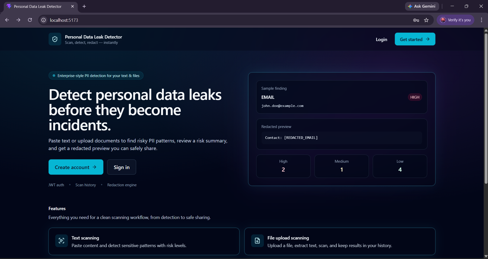
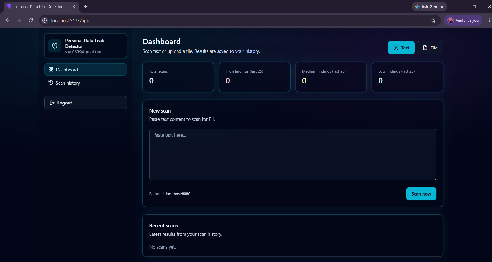
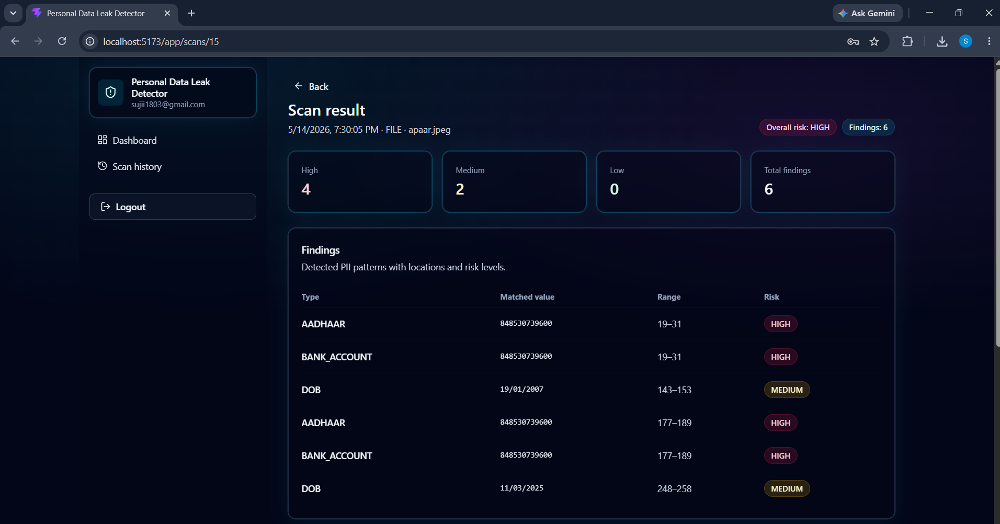
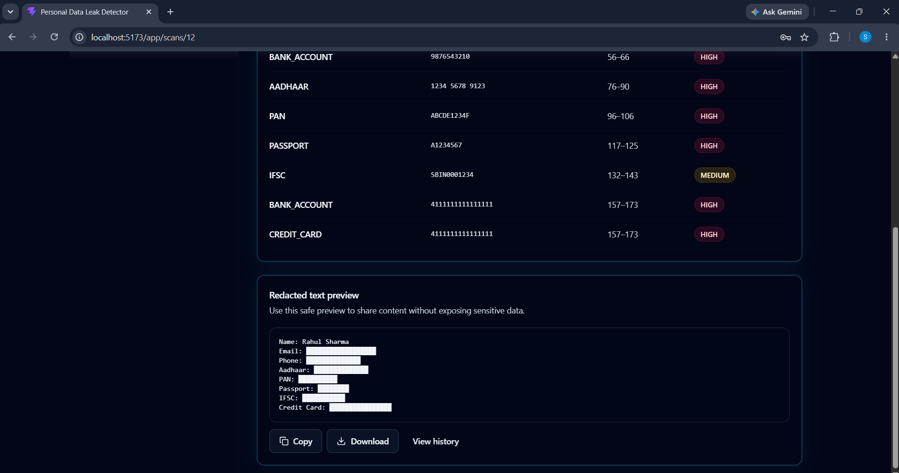
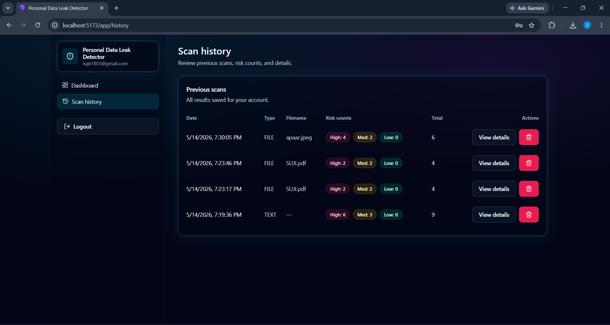
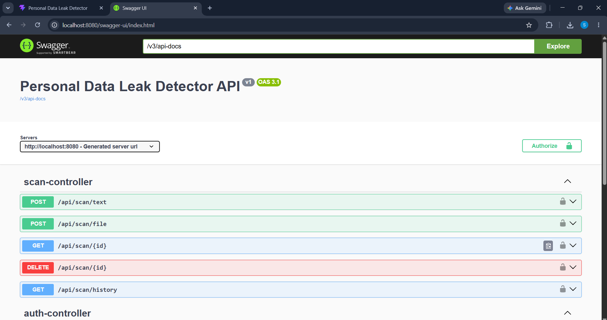

# Personal Data Leak Detector

AI-powered full-stack cybersecurity web application that detects and redacts sensitive personal information from text, documents, and images using OCR.

---

## Features

- JWT Authentication
- OCR-based Image Scanning
- Aadhaar/PAN/Passport Detection
- PDF/DOCX/TXT Parsing
- Risk Classification Engine
- Automatic Data Redaction
- Scan History Dashboard
- Responsive Cybersecurity UI

---

## Tech Stack

### Frontend
- React JSgi
- Tailwind CSS
- Axios
- React Router

### Backend
- Spring Boot
- Java
- JWT Authentication
- MySQL
- Swagger/OpenAPI

### OCR & File Processing
- Tess4J
- Apache PDFBox
- Apache POI

---

## Screenshots

### Landing Page


### Dashboard


### Scan Results


### OCR Scan


### Redacted Output


### Scan History


### Swagger API


---

## Supported PII Detection

- Email Addresses
- Indian Phone Numbers
- Aadhaar Numbers
- PAN Numbers
- Passport Numbers
- Credit Card Numbers
- Bank Account Numbers
- IFSC Codes
- IP Addresses
- URLs
- PIN Codes
- Date of Birth

---

## Setup Instructions

### Backend

```bash
cd Backend
mvn spring-boot:run
```

### Frontend

```bash
cd Frontend
npm install
npm run dev
```

---

## API Documentation

Swagger UI:

```text
http://localhost:8080/swagger-ui/index.html
```

---

## Future Enhancements

- AI-powered risk scoring
- Multi-language OCR
- Cloud deployment
- Admin analytics dashboard
- Real-time scanning
- PDF export reports

---

## Author

Suji M